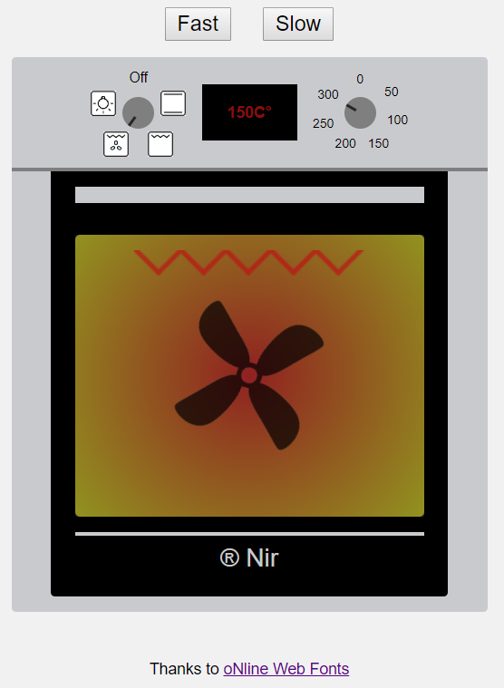

# Smart Oven

My personal project (Smart Oven) using Typescript + React + MobX + LESS + TSX

Initial run:

* Install Node.js
* `npm install`
* `npm start` In one command line
* `json-server --watch db.json --port 3001` In another command line
* Open your browser at http://http://localhost:3000/
* Enjoy!

Screenshots:

  
  

